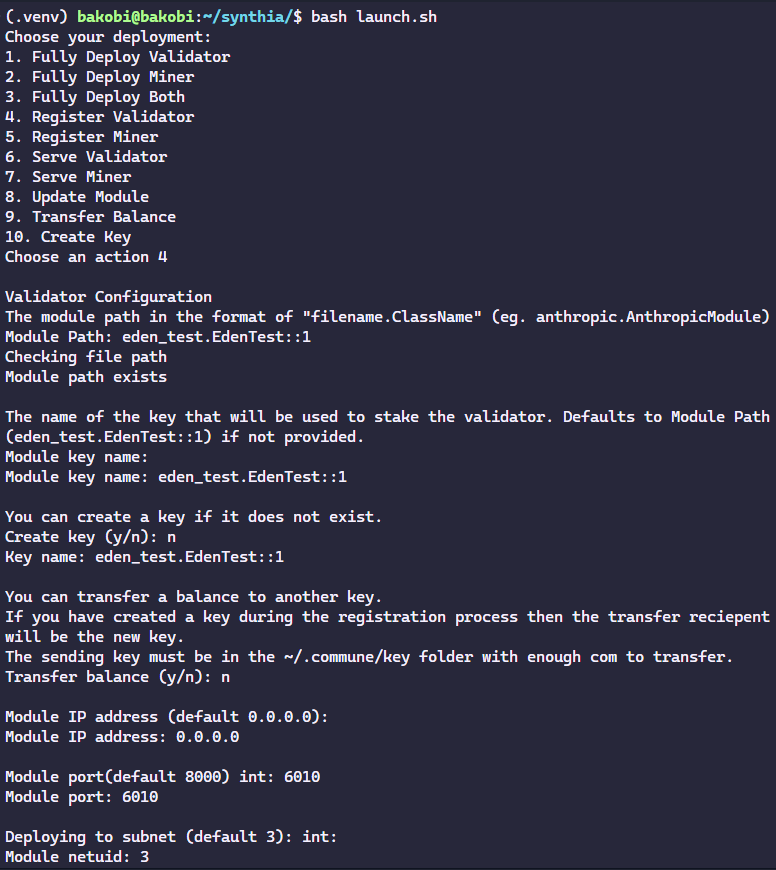

# Synthia

Welcome to the Synthia subnet, a bleeding-edge initiative to accelerate the open-source AI space. Our mission is to harness the power of Commune's decentralized incentive markets to produce a continuous stream of synthetic training data with verified quality at scale.

## Table of Contents

- [Synthia](#synthia)
  - [Table of Contents](#table-of-contents)
  - [Overview](#overview)
  - [Motivation](#motivation)
  - [Resources](#resources)
  - [Installation](#installation)
    - [Setup your environment](#setup-your-environment)
      - [With Docker](#with-docker)
        - [Operating with docker](#operating-with-docker)
      - [Manually, on Ubuntu 22.04](#manually-on-ubuntu-2204)
      - [With Nix](#with-nix)
  - [Running A Miner](#running-a-miner)
    - [Note](#note)
  - [Running A Validator](#running-a-validator)
  - [Hardware Requirements](#hardware-requirements)
    - [Minimum Requirements](#minimum-requirements)
    - [Recommended Requirements](#recommended-requirements)
  - [Launcher Script](#launcher-script)
    - [Using the launcher](#using-the-launcher)
    - [What it does](#what-it-does)
    - [Video tutorial](#video-tutorial)

## Overview

Synthia is utilizing the state-of-the-art Anthropic Claude3 API to generate open-ended high-quality and diverse synthetic in-depth explanations of subjects picked from the Opus latent space based on varying esotericity, with varying target-audience, level of detail and abstraction at scale.

While any model or API can theoretically mine in the subnet, the validation is designed to target Claude3-level quality, due to its substantially superior ability to generate the desired synthetic data. Hence, we advise mining with the Claude3 API, although support for OpenAI's API is available.

## Motivation

In the rapidly evolving world of artificial intelligence, synthetic data has emerged as a crucial component in the training of advanced models. By utilizing the state-of-the-art Anthropic Claude3 API, we can generate open-ended subject-unconstrained high-quality and diverse synthetic in-depth explanations.

Major AI labs have already recognized the potential of synthetic data and are actively utilizing it to enhance their models. However, access to such data remains limited for the broader open-source community. The Synthia subnet aims to change that.

By harnessing the power of Commune's decentralized crypto-economic incentives, we aim to create the largest reliably high-quality synthetic intelligence dataset in the world that will serve as a catalyst for innovation in the Open-Source AI space.

Join us on this important journey as we distill the Closed-Source intelligence right into the hands of the Open-Source Community!

## Resources

- You can check the HuggingFace leaderboard [here](https://huggingface.co/spaces/agicommies/synthia_subnet_leaderboard)!
- You can see the real-time dataset produced by Synthia [here](https://huggingface.co/datasets/agicommies/synthia)!

## Installation

Make sure you are on the latest CommuneX version.

```sh
pip install communex --upgrade
```

### Setup your environment

#### With Docker

- [Install Docker](https://docs.docker.com/get-docker/)
- Run `docker pull ghcr.io/agicommies/synthia:9d23f1f`
- Run `docker run -v ~/.commune:/root/.commune -it [-p <port>:<port>] ghcr.io/agicommies/synthia:9d23f1f`
- Run `poetry shell` to enter the enviroment
  
##### Operating with docker

- You can quit docker with ctrl+d
- You can dettach from your session with ctrl+p followed by ctrl+q
- You can attach back to your session by running `docker attach <id>`
- You can list the ids of your containers with `docker ps`
- Note that you should pass the ports you're going to use to the container (with `-p <port>:<port>`) to bind them to your host machine.
- You can pass enviroments variables to docker with `-e <VARIABLE>=<value>`.
    e.g `docker run -e ANTHROPIC_API_KEY=<your-anthropic-api-key> -v ~/.commune:/root/.commune -it ghcr.io/agicommies/synthia:9d23f1f`

#### Manually, on Ubuntu 22.04

- Install Python 3
  - `sudo apt install python3`
- [Install Poetry](https://python-poetry.org/docs/)
- Install the Python dependencies with `poetry install`
- **! IMPORTANT** Enter the Python environment with `poetry shell`

#### With Nix

- Install Nix with [install.determinate.systems]
- You can enter the nix shell environment with with `nix develop` or setup
  [direnv](https://direnv.net/) to automatically load the environment when you
  enter the directory.
- Install the Python dependencies with `poetry install`
- Get into the Python environment:
  - If you are using `direnv`, just re-entering the directory will do the trick.
    - Tip: you can force-reload with `direnv reload`
  - If not, you can run `poetry shell` to enter the Python environment.

[install.determinate.systems]: https://install.determinate.systems/

## Running A Miner

1. Get an API key from [Anthropic](https://console.anthropic.com/).

2. Create a file named `config.env` in the `env/` folder with the following
   contents (you can also see the `env/config.env.sample` as an example):

   ```sh
   ANTHROPIC_API_KEY="<your-anthropic-api-key>"
   OPENROUTER_API_KEY="<your-openrouter-api-key>"
   ANTHROPIC_MODEL=claude-3-opus-20240229
   ANTHROPIC_MAX_TOKENS=1000
   ANTHROPIC_TEMPERATURE=0.5
   ```

   Alternatively, you can set up those values as enviroment variables.
   Note that you just need to provide the key to the provider that you're going
   to use

3. Serve the miner:

   Make sure to be located in the root of synthia repository

   ```sh  
   cd synthia
   ```

   Proceed with running the miner:

   ```sh
   comx module serve synthia.miner.anthropic.AnthropicModule <your_commune_key> --subnets-whitelist <synthia netuid> --ip 0.0.0.0
   ```

    Alternatively, if you want to run a openrouter miner:

   ```sh
   comx module serve synthia.miner.anthropic.OpenrouterModule <your_commune_key> --subnets-whitelist <synthia netuid> --ip 0.0.0.0
   ```
  
   The **ip** is passed as **0.0.0.0** to accept **outside connections**, since the default,
   **127.0.0.1** accepts **only local** connections. Synthia has the **netuid 3**. Key is a name of your commune wallet/key.
   If you don't have a wallet, generate one by running

   ```sh
   comx key create <name>
   ```

   **Note**: you need to keep this process alive, running in the background. Some
   options are [tmux](https://www.tmux.org/](https://ioflood.com/blog/install-tmux-command-linux/)), [pm2](https://pm2.io/docs/plus/quick-start/) or [nohup](https://en.wikipedia.org/wiki/Nohup).

   Example using pm2

   ```sh
   pm2 start "comx module serve synthia.miner.anthropic.AnthropicModule <key> --subnets-whitelist <synthia netuid> --ip 0.0.0.0" --name <name>
   ```

4. Finally register the module on the Synthia subnet:

    ```sh
    comx module register <name> <your_commune_key> --ip <your-ip-address> --port <port> --netuid <synthia netuid>  
    ```

### Note

- Make sure to **serve and register** the module using the **same key**.
- If you are not sure about your `public ip` address:

   ```sh
   curl -4 https://ipinfo.io/ip
   ```

- Current `<synthia netuid>` is 3. If you want to check for yourself, you can run:

   ```sh
   comx subnet list
   ```

   And look for the name `synthia`

## Running A Validator

1. Get an API key from [Anthropic](https://console.anthropic.com/).

2. Gen an API key for embeddings from [OpenAi](https://openai.com/product)

3. Create a file named `config.env` in the `env/` folder with the following contents (you can also see the `env/config.env.sample` as an example):

   ```sh
   ANTHROPIC_API_KEY="<your-anthropic-claude-api-key>"
   OPENROUTER_API_KEY="<your-openrouter-api-key>"
   ANTHROPIC_MODEL=claude-3-opus-20240229
   ANTHROPIC_MAX_TOKENS=1000
   ANTHROPIC_TEMPERATURE=0.5
   OPENAI_API_KEY="<your-openai-api-key>"
   ```
  
    Alternatively, you can set up those values as enviroment variables.

4. Register the validator

   Note that you are required to register the validator first, this is because the validator has to be on the network in order to set weights. You can do this by running the following command:

   ```sh
   comx module register <name> <your_commune_key> --netuid <synthia netuid>
   ```

   The current synthia **netuid** is **3**.

5. Serve the validator

   ```sh
   python3 -m synthia.cli <your_commune_key> [--call-timeout <seconds>] [--provider <provider_name>]
   ```

   The default value of the `--call-timeout` parameter is 65 seconds.
   You can pass --provider openrouter to run using openrouter provider

   Note: you need to keep this process alive, running in the background. Some options are [tmux](https://www.tmux.org/](https://ioflood.com/blog/install-tmux-command-linux/)), [pm2](https://pm2.io/docs/plus/quick-start/) or [nohup](https://en.wikipedia.org/wiki/Nohup).

## Hardware Requirements

### Minimum Requirements

- **CPU:** Quad-core Intel i3 or equivalent AMD processor, 2.5 GHz
- **RAM:** 2 GB
- **Storage:** 500mb + of free space
- **GPU:** Not needed
- **Network:** Broadband internet connection for online data syncing

### Recommended Requirements

If you want to run up to ~10+ miners / validators

- **CPU:** 4-core Intel i5 or equivalent AMD processor, 2.5 GHz-3.5 GHz
- **RAM:** 4 GB or more
- **Storage:** 128 GB SSD
- **GPU:** Not needed
- **Network:** Gigabit Ethernet or better

## Launcher Script

[Eden](https://twitter.com/project_eden_ai) has provided a new bash script that will walk you through the process of launching a validator or miner for a simpler and streamlined process.

### Using the launcher

Allow commands to be executed by the script:
`chmod +x scripts/launch.sh`

Run the launcher:
`bash scripts/launch.sh`

Just follow the prompts after that.

### What it does

The launch script will prompt you step by step through the process of launching
a validator or miner or both and execute the required commands without having
to know details about the CLI.



Be aware that the launcher does execute commands that make changes on the block chain including balance transfers and module registration. Be sure you know what you'd like to do before using this tool as some actions cannot be undone. This tool is provided free of charge as is and with no warranty or guarantee. Use at your own risk.

### Video tutorial

[Video tutorial](https://www.youtube.com/watch?v=3CynHZdvbok)
